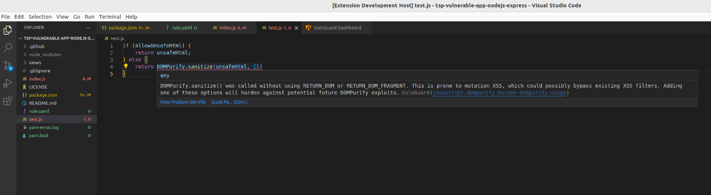

# VulnGuard
VSCode Extension to lint code for security vulnerabilities.

INSERT_VIDEO_HERE

[Watch on Youtube]()

## Installation
Install it on in the VSCode Marketplace [here](https://marketplace.visualstudio.com/items?itemName=itzybitzyspider.vulnguard).

## Features
### Vulnerability Scanning
VulnGuard scans your Node.js projects for security vulnerabilities on-the-fly as you type code. The goal is to notify developers as they are introducing a security vulnerability in order to fix the issue at the point of introduction.

Currently, VulnGuard supports 3 types of checks:
- Semgrep (Not available on Windows systems)
- Regex
- Dependency Scanning

### Viewing of Vulnerability
The extension displays vulnerabilities found using VSCode's native viewspaces, eliminating the need for extra programs installed. Vulnerabilities are "linted" in the editor itself and also shown in the Problems tab.

### Code Actions
Using VSCode Quick Fix, you can perform Code Actions on a line (similar to ESLint) by clicking the Quick Fix "Light Bulb" feature or right click the error in the Problems tab.

Currently, the following can be performed:
- Disable VulnGuard or even specific ruleset(s)
- Learn more about the ruleset(s)
- Accept VulnGuard's proposed fix

### Configuration
You can disable specific rulesets, specify which files to ignore via glob patterns, and even configure which checks to run entirely within the VulnGuard Dashboard GUI.

### How It Works
You can read more about what's under the hood in [docs.md](./docs.md).

## FAQ
**So how does VulnGuard help prevent security incidents?**

VulnGuard aligns itself towards shift-left testing by moving code vulnerability scanning earlier in the development lifecycle. Late testing has commonly resulted in vulnerabilities being found later in the development lifecycle, requiring more work to rectify - this is especially so when an unsafe package has been added as a dependency. Instead of scanning code in Continuous Integration (CI) testing after code has been committed to a Git repository, VulnGuard scans code while the developer is still writing code locally. This allows developers to rectify security issues earlier, even before they commit to a remote repository. 

**How is this different from other scanners out there?**

VulnGuard incorporates the best elements of existing scanners and solutions on the market. At present, VulnGuard supports RegEx and [Semgrep](https://semgrep.dev) checking. Semgrep is a "fast, open-source, static analysis tool for finding bugs at editor, commit and CI time". RegEx checks allows developers to add additional rules (on top of the default rulesets) to capture for more security vulnerabilities. In addition, VulnGuard incorporates dependency checking based on heuristics. This builds upon the existing work done by [Spaceracoon](https://github.com/spaceraccoon/). The specific resources can be found under [References](#references).

## Future Improvements

TO_FILL

## References
- https://github.com/microsoft/DevSkim
- https://github.com/spaceraccoon/npm-scan/
- https://github.com/NodeSecure/js-x-ray
- https://github.com/mbalabash/sdc-check
- https://github.com/insidersec/insider
- https://github.com/ajinabraham/njsscan
